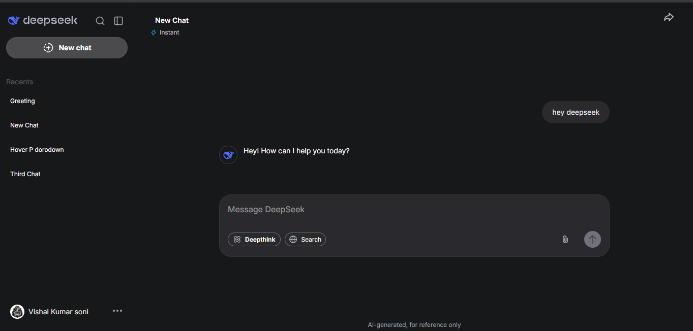
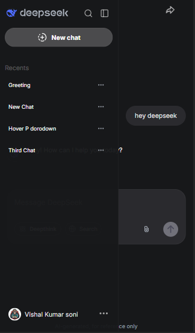
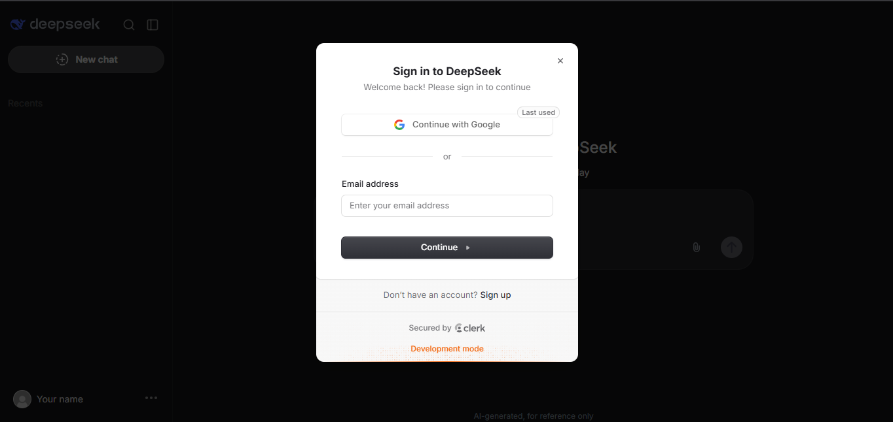

# DeepSeek AI Chat

A modern AI chat application built with **Next.js**, **React**, **MongoDB**, **Clerk**, and the **DeepSeek API**.

## Features

* 🤖 AI-powered conversations with DeepSeek
* 🔐 Authentication with Clerk
* 💬 Create and manage multiple chats
* 🗂️ Recent chat history
* ✏️ Rename conversations
* 🆕 Create new chats
* 👤 User profile
* 🚪 User sign out
* 📱 Responsive design
* 🌙 Dark-themed UI
* 💾 Persistent chat history with MongoDB
* ⚡ Next.js App Router


---

## 🖼️ Project Preview

### Dashboard UI



### Mobile view



### Clerk Authentication


---

## Tech Stack

### Frontend

* Next.js
* React
* JavaScript
* Tailwind CSS
* Lucide React

### Backend

* Next.js API Routes
* MongoDB
* Mongoose

### Authentication

* Clerk Authentication

### AI

* DeepSeek API
* OpenAI-compatible API

## Project Structure

```bash
deepseek/
├── public/
│   └── assets/
│
├── src/
│   ├── app/
│   │   ├── api/
│   │   │   ├── chat/
│   │   │   │   ├── ai/
│   │   │   │   ├── create/
│   │   │   │   ├── delete/
│   │   │   │   ├── get/
│   │   │   │   └── rename/
│   │   │   └── clerk/
│   │   │       └── route.js
│   │   │
│   │   ├── globals.css
│   │   ├── layout.js
│   │   ├── page.js
│   │   └── prism.css
│   │
│   ├── components/
│   │   ├── Chatlabel.js
│   │   ├── Message.js
│   │   ├── PromptBox.js
│   │   └── Sidebar.js
│   │
│   ├── config/
│   │   └── db.config.js
│   │
│   ├── context/
│   │   └── AppContext.js
│   │
│   └── models/
│       ├── Chat.model.js
│       └── User.model.js
│
├── .env.local
├── .gitignore
├── next.config.js
├── package.json
└── README.md
```


## Getting Started

### 1. Clone the repository

Clone the repository and move into the project directory.

### 2. Install dependencies

Run:

npm install

### 3. Configure environment variables

Create a `.env.local` file in the root directory and add:

NEXT_PUBLIC_CLERK_PUBLISHABLE_KEY=your_clerk_publishable_key

CLERK_SECRET_KEY=your_clerk_secret_key

MONGODB_URI=your_mongodb_connection_string

DEEPSEEK_API_KEY=your_deepseek_api_key

Never commit your `.env.local` file or expose secret API keys.

## Running the Application

Start the development server:

npm run dev

Then open the application in your browser at:

http://localhost:3000

## Authentication

This project uses **Clerk** to handle user authentication and account management.

Clerk provides authentication components and utilities for Next.js applications.

[Clerk Documentation](https://clerk.com/docs?utm_source=chatgpt.com)

## DeepSeek API

The application uses the DeepSeek API to generate AI responses.

DeepSeek provides an OpenAI-compatible API interface, allowing the application to communicate with DeepSeek using the OpenAI SDK.

[DeepSeek API Documentation](https://api-docs.deepseek.com/?utm_source=chatgpt.com)

## Database

MongoDB is used to store user chat data and conversation history.

Mongoose is used to define schemas and interact with MongoDB from the application.

[MongoDB Documentation](https://www.mongodb.com/docs/?utm_source=chatgpt.com)

[Mongoose Documentation](https://mongoosejs.com/docs/?utm_source=chatgpt.com)

## Chat Flow

User enters a prompt.

↓

Prompt is sent to the Next.js API.

↓

The authenticated user is verified.

↓

The prompt is sent to the DeepSeek API.

↓

DeepSeek generates an AI response.

↓

The conversation is stored in MongoDB.

↓

The response is displayed in the chat interface.

## Future Improvements

* Streaming AI responses
* Message regeneration
* Edit and resend messages
* File uploads
* Image understanding
* Voice input
* Multiple AI models
* Conversation export
* Improved mobile experience
* Rate limiting
* Production deployment
* Pricing

## Documentation

[Next.js Documentation](https://nextjs.org/docs?utm_source=chatgpt.com)

[Clerk Documentation](https://clerk.com/docs?utm_source=chatgpt.com)

[DeepSeek API Documentation](https://api-docs.deepseek.com/?utm_source=chatgpt.com)

[MongoDB Documentation](https://www.mongodb.com/docs/?utm_source=chatgpt.com)

[Mongoose Documentation](https://mongoosejs.com/docs/?utm_source=chatgpt.com)

## 👨‍💻 Author


👨‍💻 Vishal Kumar Soni

- GitHub: :https://github.com/vishal-kumar-soni
- LinkedIn:https://www.linkedin.com/in/vishal-kumar-soni-/
- Email: vkumarsoni30@gmail.com


---

# ⭐ If you like this project, give it a star on GitHub!